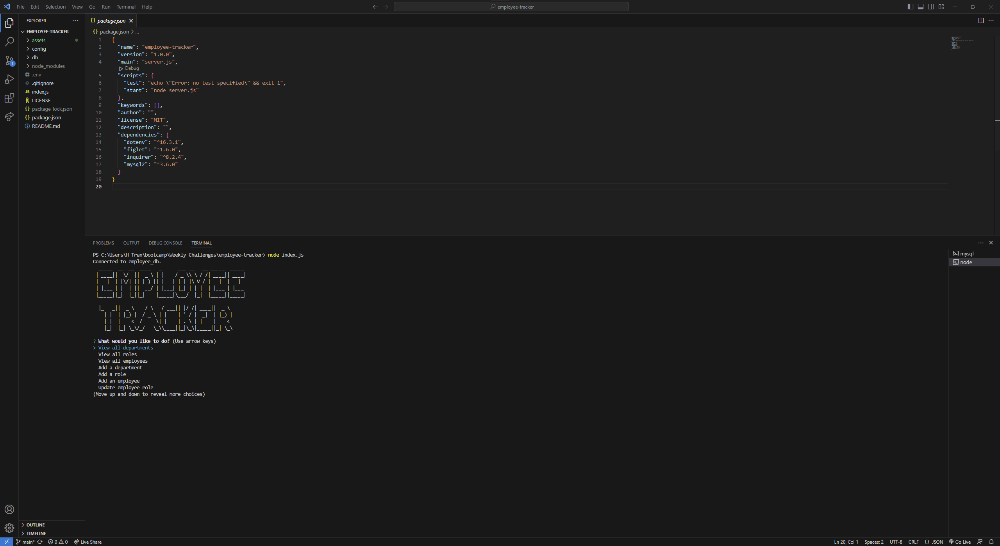

# w12-employee-tracker

## Description
this is a sample readme file

## Table of Contents

- [Installation](#installation)
- [Usage](#usage)
- [Credits](#credits)
- [License](#license)

## Installation

1. Download or clone this repository
2. [node.js](https://nodejs.org/en) is required for this application.
3. `npm i` in the terminal to install the required npm packages.
4. Add mySQL password to connection.js file.
5. `SOURCE` schema.sql and seeds.sql file.

## Usage

1. The application will be invoked by using the following command: `node index.js`

2. User is prompted with a banner and main menu with tasks.

3. User is able to view, add, update or delete selected departments, roles and employees.

This is what the application looks like when invoked.

To see how this application works, follow the [Walkthrough Video](https://drive.google.com/file/d/1GKzSJvRNhp443to077GPvU8CM3iGZWO1/view?usp=drive_link).

## License

Please refer to the LICENSE in the repo.

---